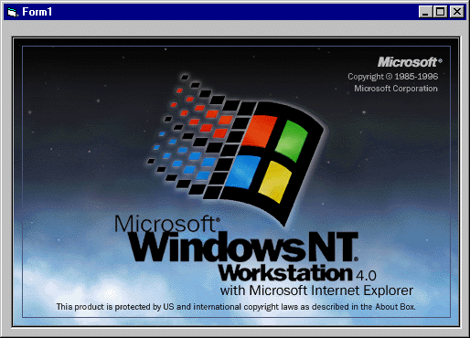



## Get BMPs from Access using ADO

### Description

This will allow you to get BMPs (only Bitmaps) from an Access database using ADO. Officially, Microsoft says this about it in MSDN:  INFO: Issues Migrating from DAO/Jet to ADO/Jet 

ID: Q225048

  OLE Container Control 

Many databases, including the SQL Server 7 Northwind database, contain pictures and other objects saved by Microsoft Access. In Visual Basic, you can see the pictures by binding the OLE Container control to the DAO Data control. However, the OLE Container control is not compatible with the ADO Data control and there is no way to access these pictures and display them using ADO. The OLE Container control cannot be used unbound because GetChunk does not retrieve the data in a format compatible with the ReadFromFile method.   Please Vote! 
 
### More Info
 

             |
---                |---
**Submitted On**   |2000-03-21 10:35:46
**By**             |[Paul Mather](https://github.com/Planet-Source-Code/PSCIndex/blob/master/ByAuthor/paul-mather.md)
**Level**          |Beginner
**User Rating**    |4.7 (71 globes from 15 users)
**Compatibility**  |VB 5\.0, VB 6\.0
**Category**       |[Databases/ Data Access/ DAO/ ADO](https://github.com/Planet-Source-Code/PSCIndex/blob/master/ByCategory/databases-data-access-dao-ado__1-6.md)
**World**          |[Visual Basic](https://github.com/Planet-Source-Code/PSCIndex/blob/master/ByWorld/visual-basic.md)
**Archive File**   |[CODE\_UPLOAD41083212000\.zip](https://github.com/Planet-Source-Code/paul-mather-get-bmps-from-access-using-ado__1-6722/archive/master.zip)

